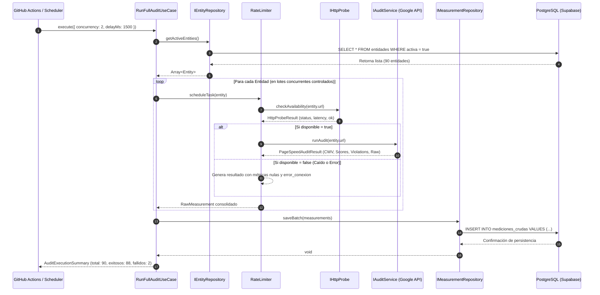

# Especificación Técnica: Módulo de Recolección y Telemetría Cruda (`packages/collector`)

- **Identificador de Especificación:** SDD-MOD-001
- **Versión:** 1.0.0
- **Estado:** Aprobado para Implementación
- **Requerimientos Asociados:** RF-001, RF-002, RF-003, RF-004, RF-005 | RNF-001, RNF-003, RNF-005, RNF-007, RNF-009, RNF-011
- **Decisiones Arquitectónicas Vinculadas:** ADR-0001 (Bun), ADR-0003 (PostgreSQL), ADR-0005 (GitHub Actions), ADR-0006 (Google APIs), ADR-0007 (Docker)

---

## 1. OBJETIVO Y CONTEXTO

### 1.1. Definición del Problema de Negocio

El Estado peruano cuenta con más de 90 portales institucionales representativos (Poder Ejecutivo, Gobiernos Regionales, Organismos Autónomos y Municipalidades Provinciales) cuya calidad técnica, disponibilidad y accesibilidad no son auditadas de manera sistemática ni neutral. Existe una carencia de datos empíricos objetivos y continuos que permitan evaluar el cumplimiento de la Ley de Gobierno Digital (D.L. 1412) y estándares internacionales (WCAG 2.1 AA, Core Web Vitals).

Este módulo resuelve la captura automatizada, periódica y no sesgada de telemetría de red y calidad web directamente de los 90 portales objetivo y a través de la API oficial de Google PageSpeed Insights, garantizando persistencia histórica inmutable en PostgreSQL (Supabase) con costos operativos nulos/mínimos (RNF-011).

### 1.2. Alcance del Módulo

#### A. QUÉ ESTÁ INCLUIDO (In-Scope)

1. **Catálogo Maestro de Entidades (RF-001, RF-005):** Lectura del catálogo de las 90 entidades desde la base de datos PostgreSQL (`entidades`), filtrando solo aquellas con flag `activa = true`.
2. **Sonda de Disponibilidad y Latencia HTTP (RF-002):** Ejecución de solicitudes HTTP `GET` nativas en Bun con timeouts estrictos (10 segundos), captura del código de estado HTTP (`status_code`), tiempo de respuesta en milisegundos (`tiempo_respuesta_ms`) y bandera booleana `disponible`.
3. **Auditoría de Desempeño y Core Web Vitals (RF-003):** Consulta estandarizada a la API v5 de Google PageSpeed Insights (estrategia `DESKTOP` y/o `MOBILE` configurable; por defecto `DESKTOP`) para extraer LCP (s), FID/INP (ms), CLS, FCP (s), TTFB (ms) y el `score_desempeno` (0-100).
4. **Auditoría de Accesibilidad WCAG 2.1 AA (RF-004):** Extracción del `score_accesibilidad` (0-100) y de la lista detallada de violaciones de accesibilidad estructuradas en JSONB desde el reporte de Lighthouse generado por Google PageSpeed.
5. **Persistencia Inmutable de Telemetría (RNF-003):** Registro de cada ejecución en la tabla `mediciones_crudas`, almacenando tanto los campos normalizados como el payload crudo (`raw_auditoria`) para auditoría forense.
6. **Manejo de Tasa y Concurrencia (Rate Limiting):** Control estricto de concurrencia (máximo 2 a 3 peticiones paralelas con backoff exponencial) para no saturar la cuota gratuita de Google PageSpeed API (25,000 queries/día, 240 QPM) ni provocar bloqueos por WAF institucional.
7. **Punto de Entrada Doble:**
   - Modo CLI autónomo (`bun run collect`) para ejecución desatendida en GitHub Actions (ADR-0005).
   - Exportación de Caso de Uso (`RunFullAuditUseCase`) para invocación directa por el Backend API en Fase 2.

#### B. QUÉ QUEDA EXCLUIDO (Out-of-Scope)

1. Cálculo de SLAs mensuales o agregados temporales (responsabilidad del Módulo Analítico SDD-MOD-002).
2. Detección y ciclo de vida de incidentes ITIL v4 (responsabilidad del Módulo Analítico SDD-MOD-002).
3. Ponderaciones subjetivas o cálculo del Score Global 0-100 (responsabilidad de SDD-MOD-002).
4. Interfaz gráfica de usuario o dashboard (responsabilidad del Frontend SDD-MOD-004).
5. Modificación o creación manual de entidades vía interfaz web (Fase 2).

---

## 2. MODELO DE DOMINIO Y ENTIDADES (DDD)

### 2.1. Entidades del Dominio

#### Entidad 1: `Entity` (Entidad Pública)

Representa un portal institucional del Estado peruano registrado en el catálogo maestro.

| Atributo    | Tipo de Dato TypeScript | Tipo de Dato PostgreSQL | Restricción / Validación                                                       | Descripción                         |
| :---------- | :---------------------- | :---------------------- | :----------------------------------------------------------------------------- | :---------------------------------- |
| `id`        | `number`                | `INTEGER` / `SERIAL`    | `PK`, `> 0`                                                                    | Identificador único secuencial.     |
| `nombre`    | `string`                | `VARCHAR(255)`          | `NOT NULL`, `1..255 chars`                                                     | Nombre oficial de la entidad.       |
| `url`       | `string`                | `VARCHAR(500)`          | `NOT NULL`, `UNIQUE`, `Valid HTTPS URL`                                        | URL raíz oficial auditada.          |
| `categoria` | `EntityCategory` (Enum) | `VARCHAR(50)`           | `'Ministerio' \| 'GORE' \| 'Organismo Autónomo' \| 'Municipalidad Provincial'` | Clasificación administrativa.       |
| `region`    | `string \| null`        | `VARCHAR(100)`          | Opcional para alcance nacional                                                 | Región o departamento político.     |
| `activa`    | `boolean`               | `BOOLEAN`               | `DEFAULT true`                                                                 | Estado de monitoreo activo/pausado. |
| `createdAt` | `Date`                  | `TIMESTAMPTZ`           | `DEFAULT CURRENT_TIMESTAMP`                                                    | Fecha de creación del registro.     |
| `updatedAt` | `Date`                  | `TIMESTAMPTZ`           | `DEFAULT CURRENT_TIMESTAMP`                                                    | Fecha de última modificación.       |

#### Entidad 2: `RawMeasurement` (Medición Cruda de Telemetría)

Representa una captura de telemetría atómica e inmutable obtenida en un instante de tiempo para una entidad específica.

| Atributo               | Tipo de Dato TypeScript            | Tipo de Dato PostgreSQL | Restricción / Validación                | Descripción                                              |
| :--------------------- | :--------------------------------- | :---------------------- | :-------------------------------------- | :------------------------------------------------------- |
| `id`                   | `number \| undefined`              | `BIGSERIAL`             | `PK`, Autoincremental                   | Identificador único de medición.                         |
| `entidadId`            | `number`                           | `INTEGER`               | `FK -> entidades(id) ON DELETE CASCADE` | Identificador de la entidad evaluada.                    |
| `fechaCaptura`         | `Date`                             | `TIMESTAMPTZ`           | `DEFAULT CURRENT_TIMESTAMP`             | Momento exacto de la auditoría.                          |
| `statusCode`           | `number \| null`                   | `INTEGER`               | `100..599` o `null` si timeout/DNS      | Código HTTP devuelto por el servidor.                    |
| `tiempoRespuestaMs`    | `number \| null`                   | `FLOAT`                 | `≥ 0` en milisegundos                   | Latencia total de la conexión HTTP.                      |
| `disponible`           | `boolean`                          | `BOOLEAN`               | `NOT NULL`                              | `true` si HTTP 200/3xx válido; `false` si error o caída. |
| `errorConexion`        | `string \| null`                   | `TEXT`                  | Mensaje de excepción normalizado        | Registro de error en caso de fallo de red.               |
| `lcpSegundos`          | `number \| null`                   | `FLOAT`                 | `≥ 0`                                   | Largest Contentful Paint (segundos).                     |
| `fidMs`                | `number \| null`                   | `FLOAT`                 | `≥ 0`                                   | First Input Delay / INP (milisegundos).                  |
| `clsScore`             | `number \| null`                   | `FLOAT`                 | `≥ 0`                                   | Cumulative Layout Shift.                                 |
| `fcpSegundos`          | `number \| null`                   | `FLOAT`                 | `≥ 0`                                   | First Contentful Paint (segundos).                       |
| `ttfbMs`               | `number \| null`                   | `FLOAT`                 | `≥ 0`                                   | Time to First Byte (milisegundos).                       |
| `scoreDesempeno`       | `number \| null`                   | `INTEGER`               | `0..100`                                | Puntaje de Rendimiento Lighthouse.                       |
| `scoreAccesibilidad`   | `number \| null`                   | `INTEGER`               | `0..100`                                | Puntaje de Accesibilidad Lighthouse.                     |
| `erroresAccesibilidad` | `AccessibilityViolation[] \| null` | `JSONB`                 | Estructura validada                     | Violaciones WCAG 2.1 detectadas.                         |
| `rawAuditoria`         | `Record<string, unknown> \| null`  | `JSONB`                 | Payload JSON intacto                    | Respuesta completa de PageSpeed API.                     |

#### Value Object: `AccessibilityViolation`

Estructura contenida en el array `errores_accesibilidad`:

```typescript
interface AccessibilityViolation {
  id: string; // Ej: "color-contrast", "image-alt", "label"
  title: string; // Descripción corta de la regla WCAG
  description: string; // Detalle normativo y guía de solución
  score: number | null; // Valor de evaluación de Lighthouse
  impact?: "critical" | "serious" | "moderate" | "minor";
  elements: Array<{
    selector: string; // Selector CSS del nodo infractor
    snippet: string; // Fragmento HTML
    explanation?: string; // Motivo del fallo puntual
  }>;
}
```

### 2.2. Relaciones entre Entidades

- **`Entity` (1) ─── (0..N) `RawMeasurement`**:
  - Una entidad pública acumula múltiples mediciones crudas a lo largo del tiempo (1 captura diaria x 365 días = ~365 registros anuales por entidad; ~32,850 registros anuales para 90 entidades).
  - La clave foránea `entidad_id` en `mediciones_crudas` referencia a `entidades.id`.
  - Integridad referencial con `ON DELETE CASCADE`.

---

## 3. REQUISITOS FUNCIONALES Y FLUJOS DE EJECUCIÓN

### 3.1. Caso de Uso 1: `RunFullAuditUseCase` (Auditoría Integral por Lotes)



#### Flujo Detallado Paso a Paso

1. **Inicialización:** Se validan las variables de entorno (`SUPABASE_URL`, `SUPABASE_SERVICE_ROLE_KEY`, `GOOGLE_PAGESPEED_API_KEY`). Si falta alguna, el proceso se aborta inmediatamente con código de salida `1`.
2. **Obtención del Catálogo:** Se invoca `IEntityRepository.getActiveEntities()`. Si el catálogo está vacío, se registra advertencia y finaliza con éxito sin escrituras.
3. **Procesamiento Concurrente:** Se itera la lista de entidades procesando lotes de tamaño configurable (por defecto `batchSize = 2`, pausa entre llamadas `1200 ms`).
4. **Sondeo HTTP Primario:**
   - Se realiza petición HTTP `GET` a la URL de la entidad con cabecera `User-Agent: ObservatorioDigitalBot/1.0 (+https://observatoriodigital.gob.pe)`.
   - Timeout máximo de red: 10,000 ms.
   - Si responde con código `200..399`, `disponible = true`.
   - Si responde con `4xx`, `5xx`, o si ocurre `TimeoutError`, `DNSLookupError` o `SSLError`, se captura la excepción en `error_conexion` y `disponible = false`.
5. **Auditoría PageSpeed (Solo si el portal responde o con reintento configurable):**
   - Se invoca `https://pagespeedonline.googleapis.com/pagespeedonline/v5/runPagespeed?url={URL}&key={API_KEY}&category=PERFORMANCE&category=ACCESSIBILITY&strategy=DESKTOP`.
   - En caso de error HTTP 429 (Cuota excedida) o 500/503 de la API de Google, se ejecuta reintento con backoff exponencial (1 intento adicional tras 3 segundos). Si persiste el error, se guarda la medición con métricas de PageSpeed en `null` y `error_conexion = 'Google API Error: ...'`.
6. **Mapeo de Datos:** Se combinan los resultados del sondeo HTTP y de PageSpeed en un objeto `RawMeasurement`.
7. **Persistencia en Base de Datos:** Al terminar la captura se ejecutan inserciones secuenciales de hasta 10 mediciones. Se evita la concurrencia y el `statement timeout` provocado por el payload JSON completo de PageSpeed. Si Supabase rechaza un lote, la ejecución falla explícitamente indicando el lote afectado.
8. **Definition of Done (DoD) para SDD-MOD-001:**
   - La suite de pruebas unitarias (`bun test`) pasa al 100% con mocks de red.
   - El script `bun run collect` se ejecuta de inicio a fin sobre una base de datos PostgreSQL local/remota y puebla 90 registros en `mediciones_crudas` sin interrupciones por excepciones no controladas.
   - Ninguna credencial ni clave de API se expone en logs ni en el código fuente.

---

## 4. ESPECIFICACIÓN DE INTERFACES Y CONTRATOS DE CÓDIGO (TypeScript)

### 4.1. Puertos del Dominio (`core/ports/`)

```typescript
// core/ports/entity-repository.port.ts
import { Entity } from "../models/entity.model";

export interface IEntityRepository {
  getActiveEntities(): Promise<Entity[]>;
  getById(id: number): Promise<Entity | null>;
}

// core/ports/measurement-repository.port.ts
import { RawMeasurement } from "../models/raw-measurement.model";

export interface IMeasurementRepository {
  save(measurement: RawMeasurement): Promise<void>;
  saveBatch(measurements: RawMeasurement[]): Promise<{ insertedCount: number }>;
}

// core/ports/http-probe.port.ts
export interface HttpProbeResult {
  statusCode: number | null;
  responseTimeMs: number;
  isAvailable: boolean;
  errorMessage: string | null;
}

export interface IHttpProbe {
  checkAvailability(url: string, timeoutMs?: number): Promise<HttpProbeResult>;
}

// core/ports/audit-service.port.ts
export interface PageSpeedAuditResult {
  lcpSeconds: number | null;
  fidMs: number | null;
  clsScore: number | null;
  fcpSeconds: number | null;
  ttfbMs: number | null;
  performanceScore: number | null;
  accessibilityScore: number | null;
  accessibilityViolations: AccessibilityViolation[];
  rawPayload: Record<string, unknown>;
}

export interface IAuditService {
  runAudit(
    url: string,
    strategy?: "DESKTOP" | "MOBILE",
  ): Promise<PageSpeedAuditResult>;
}
```

### 4.2. Contrato del Caso de Uso Principal

```typescript
// application/run-full-audit.usecase.ts
export interface AuditRunOptions {
  concurrency?: number; // Por defecto: 2
  delayBetweenCallsMs?: number; // Por defecto: 1000 ms
  strategy?: "DESKTOP" | "MOBILE"; // Por defecto: 'DESKTOP'
}

export interface AuditRunSummary {
  startedAt: Date;
  finishedAt: Date;
  totalEntities: number;
  successfulAudits: number;
  failedAudits: number;
  durationSeconds: number;
  errors: Array<{ entityId: number; url: string; error: string }>;
}

export class RunFullAuditUseCase {
  constructor(
    private readonly entityRepo: IEntityRepository,
    private readonly measurementRepo: IMeasurementRepository,
    private readonly httpProbe: IHttpProbe,
    private readonly auditService: IAuditService,
  ) {}

  async execute(options?: AuditRunOptions): Promise<AuditRunSummary>;
}
```

---

## 5. ARQUITECTURA Y REGLAS DE NEGOCIO

### 5.1. Reglas Técnicas y Restricciones

1. **Clean Architecture / Puertos y Adaptadores:** El núcleo del dominio y casos de uso en `src/core/` no debe tener ninguna dependencia externa (ni Supabase, ni Google SDK, ni librerías HTTP de terceros). Todo acceso a I/O se realiza vía interfaces de `src/core/ports/`.
2. **Uso de Bun Nativo (ADR-0001):** Emplear `Bun.serve` o `fetch` nativo optimizado con `AbortSignal.timeout(10000)` para las sondas de red.
3. **Cero Juicios en Fase 1 (ADR-0003):** La capa de captura jamás altera o redondea las métricas emitidas por Google PageSpeed ni calcula ponderaciones de cumplimiento.
4. **Resistencia a Fallos Individuales:** El fallo de auditoría de una entidad (ej. caída de portal de un municipio con DNS inexistente) no debe abortar la ejecución del resto del lote. El error debe aislarse y persistirse como `disponible = false`.

### 5.2. Casos Límite (Edge Cases) y Manejo de Errores

| Caso Límite                                      | Causa Raíz                                         | Estrategia de Manejo y Mitigación                                                                                                                                                                                                 |
| :----------------------------------------------- | :------------------------------------------------- | :-------------------------------------------------------------------------------------------------------------------------------------------------------------------------------------------------------------------------------- |
| **Portal con Certificado SSL Vencido**           | Error de negociación TLS/SSL en el portal estatal. | Capturar error `CERT_HAS_EXPIRED`. Guardar `status_code = null`, `disponible = false`, `error_conexion = 'SSL_ERROR: Certificate expired'`.                                                                                       |
| **Portal con Redirección Infinita**              | Bucle 301/302 mal configurado en la entidad.       | Limitar saltos de redirección a máximo 5. Si excede, registrar `disponible = false` con `error_conexion = 'ERR_TOO_MANY_REDIRECTS'`.                                                                                              |
| **Cuota de Google PageSpeed Agotada (HTTP 429)** | Exceso transitorio de consultas por minuto.        | Aplicar pausa forzada de 10 segundos y 1 reintento. Si falla, persistir datos HTTP y dejar campos de auditoría en `null`.                                                                                                         |
| **Portal responde extremadamente lento (> 10s)** | Servidor institucional saturado.                   | Disparar aborto de timeout tras 10s exactos. Registrar `tiempo_respuesta_ms = 10000`, `disponible = false`, `error_conexion = 'TIMEOUT_EXCEEDED_10000MS'`.                                                                        |
| **Base de datos Supabase no disponible**         | Caída de red o reinicio del clúster PostgreSQL.    | Implementar 3 reintentos con backoff (1s, 2s, 4s). Si persiste, volcar métricas recopiladas a un archivo local de emergencia `fallback-metrics-<timestamp>.json` y terminar con código de error para reintento de GitHub Actions. |

---

## 6. CRITERIOS DE ACEPTACIÓN Y PRUEBAS (TDD)

### Escenario 1: Sondeo HTTP y Auditoría Exitosa de un Portal Operativo

- **Dado que** existe una entidad activa en la base de datos con URL `"https://www.gob.pe/minsa"`.
- **Cuando** se ejecuta el caso de uso `RunFullAuditUseCase`.
- **Entonces** la sonda HTTP debe registrar `status_code = 200`, `disponible = true`, y un `tiempo_respuesta_ms > 0`.
- **Y** el servicio de auditoría debe poblar `lcp_segundos`, `cls_score`, `score_desempeno` y `score_accesibilidad` con valores entre 0 y 100.
- **Y** se debe insertar exactamente 1 registro en `mediciones_crudas` referenciando el `entidad_id` correspondiente.

### Escenario 2: Detección y Aislamiento de Portal Caído (HTTP 503)

- **Dado que** la URL de una entidad devuelve código HTTP 503 Service Unavailable.
- **Cuando** se ejecuta el sondeo sobre dicha URL.
- **Entonces** la medición resultante debe tener `status_code = 503`, `disponible = false`, y `error_conexion` conteniendo `"HTTP 503 Service Unavailable"`.
- **Y** no se debe invocar a la API de Google PageSpeed para ahorrar cuota.
- **Y** la ejecución del lote completo debe continuar sin interrupción para las entidades restantes.

### Escenario 3: Resistencia ante Timeout de Red

- **Dado que** un servidor web gubernamental no responde dentro del límite de 10,000 ms.
- **Cuando** se ejecuta la sonda HTTP.
- **Entonces** la promesa de red debe cancelarse automáticamente sin bloquear el hilo de ejecución.
- **Y** el registro persistido debe contener `disponible = false` y `error_conexion = "TIMEOUT_EXCEEDED_10000MS"`.

### Escenario 4: Auditoría por Lotes Respeta Rate Limiting

- **Dado que** se deben auditar 90 entidades activas.
- **Cuando** se inicia `RunFullAuditUseCase` con concurrencia máxima 2 y delay de 1200 ms.
- **Entonces** nunca debe haber más de 2 peticiones activas simultáneas hacia la API de Google PageSpeed.
- **Y** el tiempo total de ejecución debe ser de al menos 54 segundos para 90 entidades, evitando el bloqueo por cuota.
