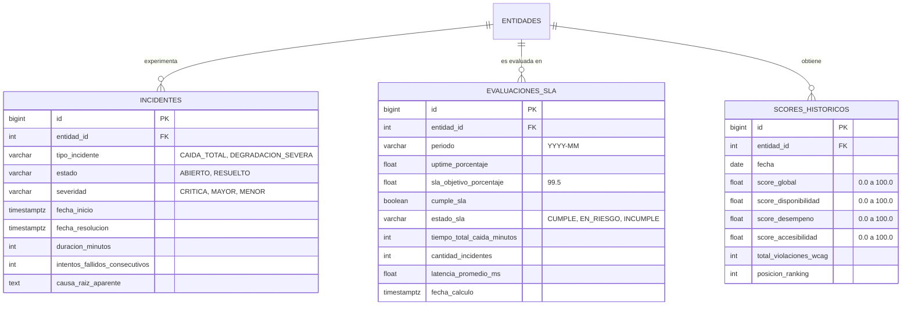
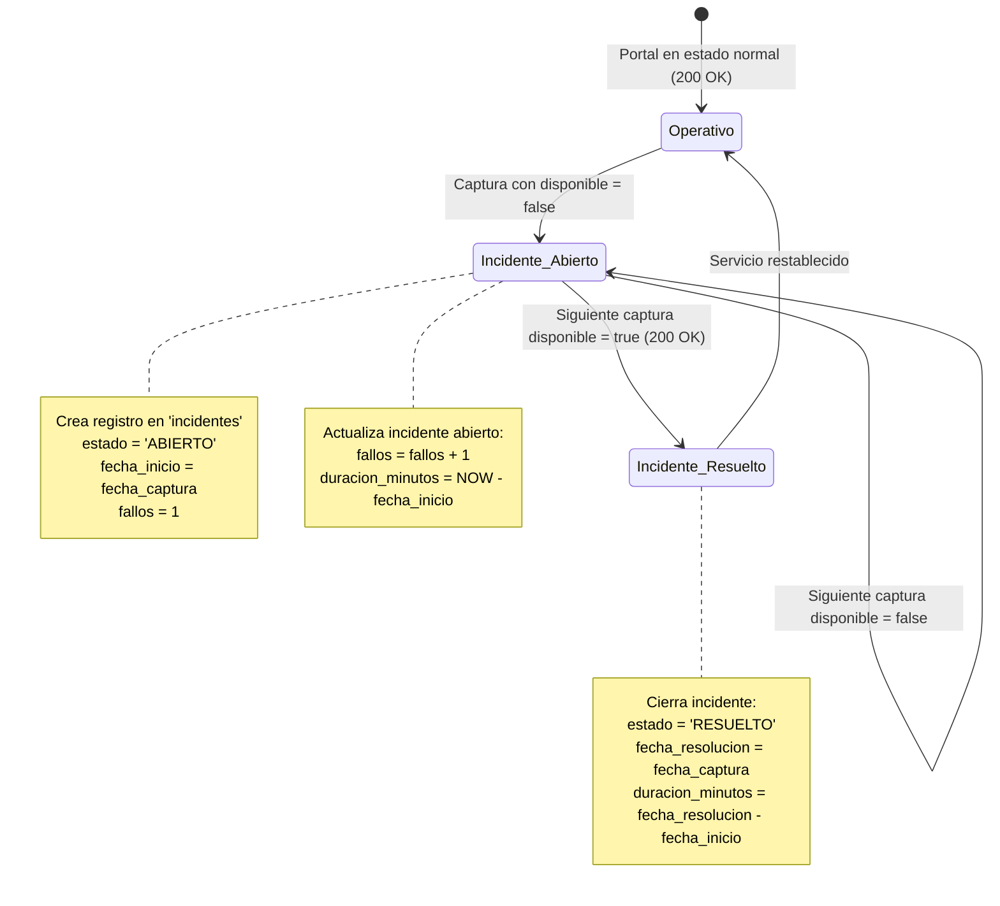

# Especificación Técnica: Motor Analítico de Calidad, SLAs e Incidentes ITIL v4

* **Identificador de Especificación:** SDD-MOD-002
* **Versión:** 1.0.0
* **Estado:** Aprobado para Implementación
* **Requerimientos Asociados:** RF-006, RF-007, RF-008, RF-009, RF-012 | RNF-001, RNF-003, RNF-007, RNF-010
* **Decisiones Arquitectónicas Vinculadas:** ADR-0001 (Bun), ADR-0003 (PostgreSQL)

---

## 1. OBJETIVO Y CONTEXTO

### 1.1. Definición del Problema de Negocio
Las mediciones crudas de telemetría (códigos HTTP, milisegundos de latencia y métricas de Lighthouse) son datos técnicos aislados que no informan directamente si una institución pública cumple con la calidad de servicio requerida por la ciudadanía y la normativa estatal (D.L. 1412). Además, el marco ITIL v4 exige gestionar eventos, incidentes de disponibilidad y el cumplimiento de Acuerdos de Nivel de Servicio (SLAs) de manera sistemática.

Este módulo transforma las series temporales de `mediciones_crudas` en:
1. **Puntajes Globales de Cumplimiento (0-100):** Un índice multidimensional y transparente para rankings públicos.
2. **Ciclo de Vida de Incidentes ITIL v4:** Detección de caídas de servicio, cálculo de duración de indisponibilidad y tiempos medios de recuperación (MTTR).
3. **Evaluación Formal de SLAs:** Comparación del desempeño mensual frente a objetivos contractuales (ej. Uptime ≥ 99.5%, Latencia ≤ 2000 ms).
4. **Detección de Anomalías:** Alertas tempranas ante degradación severa de velocidad o fallos repetitivos.

### 1.2. Alcance del Módulo

#### A. QUÉ ESTÁ INCLUIDO (In-Scope)
1. **Normalización de Métricas (RF-007):** Función matemática determinista para mapear métricas continuas (LCP en segundos, TTFB en ms, porcentaje de uptime) a una escala estándar de 0 a 100 puntos.
2. **Cálculo del Índice de Calidad Digital (RF-006):** Fórmula compuesta ponderada (40% Disponibilidad, 30% Rendimiento Core Web Vitals, 30% Accesibilidad WCAG 2.1).
3. **Motor de Incidentes ITIL v4 (RF-012):** Máquina de estados para detectar inicio de caídas (`disponible = false`), agrupar sondas fallidas consecutivas, registrar fecha de inicio/fin, calcular tiempo total de indisponibilidad (minutos) y categorizar severidad (Crítico, Mayor, Menor).
4. **Motor de Evaluación de SLAs (RF-012):** Agregador temporal (ventana móvil de 30 días o mensual calendario) que calcula el porcentaje de uptime real, compara contra el umbral del 99.5% y emite dictamen: `CUMPLE`, `EN_RIESGO` (98.0% - 99.49%), `INCUMPLE` (< 98.0%).
5. **Detección de Anomalías (RF-008):** Reglas estadísticas para identificar degradaciones abruptas de velocidad (incremento del LCP > 200% respecto a la mediana móvil de 7 días).
6. **Agregaciones Históricas (RF-009):** Generación de resúmenes diarios/semanales/mensuales por entidad, categoría y región política.

#### B. QUÉ QUEDA EXCLUIDO (Out-of-Scope)
1. Conexión de red directa a portales externos o APIs de Google (responsabilidad exclusiva de SDD-MOD-001).
2. Notificaciones push externas como SMS o Webhooks de Slack/PagerDuty (Fase 2 extendida).
3. Modificación del esquema de captura cruda existente.

---

## 2. MODELO DE DOMINIO Y ENTIDADES (DDD)

### 2.1. Entidades del Dominio



#### Entidad 1: `Incident` (Incidente de Servicio ITIL v4)

| Atributo | Tipo TypeScript | Tipo PostgreSQL | Restricción / Validación | Descripción |
| :--- | :--- | :--- | :--- | :--- |
| `id` | `number` | `BIGSERIAL` | `PK` | Identificador único del incidente. |
| `entidadId` | `number` | `INTEGER` | `FK -> entidades(id)` | Entidad afectada. |
| `tipoIncidente` | `IncidentType` | `VARCHAR(50)` | `'CAIDA_TOTAL' \| 'DEGRADACION_SEVERA'` | Clasificación del evento. |
| `estado` | `IncidentStatus` | `VARCHAR(30)` | `'ABIERTO' \| 'RESUELTO'` | Estado del ciclo de vida ITIL. |
| `severidad` | `IncidentSeverity` | `VARCHAR(20)` | `'CRITICA' \| 'MAYOR' \| 'MENOR'` | Impacto en el servicio. |
| `fechaInicio` | `Date` | `TIMESTAMPTZ` | `NOT NULL` | Momento de la primera sonda fallida. |
| `fechaResolucion` | `Date \| null` | `TIMESTAMPTZ` | `NULL` mientras esté abierto | Momento del primer sondeo exitoso posterior. |
| `duracionMinutos` | `number \| null` | `INTEGER` | `≥ 0` | Minutos transcurridos de indisponibilidad. |
| `fallosConsecutivos` | `number` | `INTEGER` | `≥ 1`, `DEFAULT 1` | Contador de capturas fallidas acumuladas. |
| `causaRaizAparente`| `string \| null` | `TEXT` | `HTTP 500 / TIMEOUT / SSL_ERROR` | Diagnóstico automático inicial. |

#### Entidad 2: `SlaEvaluation` (Evaluación de Nivel de Servicio)

| Atributo | Tipo TypeScript | Tipo PostgreSQL | Restricción / Validación | Descripción |
| :--- | :--- | :--- | :--- | :--- |
| `id` | `number` | `BIGSERIAL` | `PK` | Identificador de la evaluación. |
| `entidadId` | `number` | `INTEGER` | `FK -> entidades(id)` | Entidad evaluada. |
| `periodo` | `string` | `VARCHAR(7)` | Formato `'YYYY-MM'` | Mes evaluado (ej. `'2026-09'`). |
| `uptimePorcentaje` | `number` | `FLOAT` | `0.00..100.00` | % de disponibilidad acumulada. |
| `slaObjetivo` | `number` | `FLOAT` | `DEFAULT 99.5` | Umbral acordado estándar. |
| `cumpleSla` | `boolean` | `BOOLEAN` | `NOT NULL` | `true` si `uptimePorcentaje >= slaObjetivo`. |
| `estadoSla` | `SlaStatus` | `VARCHAR(20)` | `'CUMPLE' \| 'EN_RIESGO' \| 'INCUMPLE'` | Semáforo de gobernanza TI. |
| `totalCaidaMinutos`| `number` | `INTEGER` | `≥ 0` | Minutos de inactividad en el periodo. |
| `cantidadIncidentes`| `number`| `INTEGER` | `≥ 0` | Total de caídas detectadas en el mes. |
| `latenciaPromedioMs`| `number`| `FLOAT` | `≥ 0` | Promedio mensual de latencia HTTP. |
| `fechaCalculo` | `Date` | `TIMESTAMPTZ` | `DEFAULT CURRENT_TIMESTAMP` | Marca temporal del cómputo. |

#### Entidad 3: `EntityScore` (Puntaje Compuesto Normalizado)

| Atributo | Tipo TypeScript | Tipo PostgreSQL | Restricción / Validación | Descripción |
| :--- | :--- | :--- | :--- | :--- |
| `id` | `number` | `BIGSERIAL` | `PK` | Identificador de puntuación. |
| `entidadId` | `number` | `INTEGER` | `FK -> entidades(id)` | Entidad calificada. |
| `fecha` | `string` | `DATE` | Formato `'YYYY-MM-DD'` | Día calendario evaluado. |
| `scoreGlobal` | `number` | `FLOAT` | `0.0..100.0` | Puntaje general ponderado final. |
| `scoreDisponibilidad`| `number` | `FLOAT` | `0.0..100.0` | Sub-score de Uptime (peso 40%). |
| `scoreDesempeno` | `number` | `FLOAT` | `0.0..100.0` | Sub-score de Rendimiento (peso 30%). |
| `scoreAccesibilidad`| `number` | `FLOAT` | `0.0..100.0` | Sub-score de Accesibilidad (peso 30%). |
| `totalViolacionesWcag`| `number` | `INTEGER` | `≥ 0` | Conteo total de violaciones WCAG 2.1. |
| `posicionRanking` | `number` | `INTEGER` | `1..90` | Posición en el ranking del día. |

---

## 3. REQUISITOS FUNCIONALES Y LÓGICA DE PROCESAMIENTO

### 3.1. Caso de Uso 1: Cálculo del Índice de Calidad Digital (RF-006, RF-007)

#### A. Fórmula de Ponderación Oficial
El Índice de Calidad Digital de una entidad $i$ para un periodo dado se define mediante la siguiente combinación lineal:

$$\text{ScoreGlobal}_i = (0.40 \times \text{ScoreDisp}_i) + (0.30 \times \text{ScorePerf}_i) + (0.30 \times \text{ScoreAcc}_i)$$

Donde cada dimensión se calcula sobre una escala normalizada de 0 a 100:

1. **Sub-score de Disponibilidad ($\text{ScoreDisp}_i$):**
   $$\text{ScoreDisp}_i = \left( \frac{\text{Sondas Exitosas}}{\text{Total de Sondas en el Periodo}} \right) \times 100$$
   *Si el portal estuvo 100% disponible en sus mediciones, $\text{ScoreDisp} = 100$. Si estuvo caído la mitad del tiempo, $\text{ScoreDisp} = 50$.*

2. **Sub-score de Rendimiento Core Web Vitals ($\text{ScorePerf}_i$):**
   $$\text{ScorePerf}_i = \text{Media de los últimos 7 días de } \texttt{score\\_desempeno} \text{ (Lighthouse)}$$
   *Si $\texttt{score\\_desempeno}$ es `null` por fallo de auditoría, se utiliza el valor válido más reciente en una ventana de 14 días.*

3. **Sub-score de Accesibilidad WCAG 2.1 ($\text{ScoreAcc}_i$):**
   $$\text{ScoreAcc}_i = \max\left(0, \texttt{score\\_accesibilidad} - (\text{Violaciones Críticas} \times 5)\right)$$
   *Garantiza penalización estricta por barreras insalvables para usuarios con discapacidad.*

---

### 3.2. Caso de Uso 2: Máquina de Estados de Incidentes ITIL v4 (RF-012)



#### Clasificación Automática de Severidad:
* **`CRITICA`**: Duración de caída continua $> 120\text{ minutos}$ o fallo generalizado en Ministerios/GOREs.
* **`MAYOR`**: Duración entre $30\text{ y }120\text{ minutos}$.
* **`MENOR`**: Caída transitoria resuelta en la siguiente captura ($< 30\text{ minutos}$).

---

### 3.3. Caso de Uso 3: Evaluación y Cumplimiento de SLAs (RF-012)
Para cada entidad al cierre de cada ciclo diario o mensual:
1. Se consulta el total de minutos del mes ($T_{\text{mes}} = \text{días} \times 24 \times 60$).
2. Se suma la duración de indisponibilidad de todos los incidentes del mes ($T_{\text{caída}}$).
3. Se calcula el Uptime real:
   $$\text{Uptime}_{\text{real}} = \frac{T_{\text{mes}} - T_{\text{caída}}}{T_{\text{mes}}} \times 100$$
4. Se asigna el estado de SLA:
   - $\text{Uptime}_{\text{real}} \ge 99.50\% \implies \texttt{CUMPLE}$
   - $98.00\% \le \text{Uptime}_{\text{real}} < 99.50\% \implies \texttt{EN\_RIESGO}$
   - $\text{Uptime}_{\text{real}} < 98.00\% \implies \texttt{INCUMPLE}$

---

## 4. ESPECIFICACIÓN DE INTERFACES Y CONTRATOS (TypeScript)

### 4.1. Servicios del Dominio Analítico

```typescript
// core/domain/services/score-calculator.service.ts
export interface DimensionWeights {
  availability: number; // 0.40
  performance: number;  // 0.30
  accessibility: number;// 0.30
}

export interface ScoreCalculationInput {
  entityId: number;
  uptimePercentage: number;
  performanceScoreLighthouse: number | null;
  accessibilityScoreLighthouse: number | null;
  criticalViolationsCount: number;
}

export interface ScoreCalculationResult {
  scoreGlobal: number;
  scoreDisponibilidad: number;
  scoreDesempeno: number;
  scoreAccesibilidad: number;
}

export interface IScoreCalculatorService {
  calculateScore(input: ScoreCalculationInput, weights?: DimensionWeights): ScoreCalculationResult;
}

// core/domain/services/incident-manager.service.ts
export interface ProcessProbeEventInput {
  entityId: number;
  captureTime: Date;
  isAvailable: boolean;
  statusCode: number | null;
  errorMessage: string | null;
}

export interface IIncidentManagerService {
  processProbeEvent(event: ProcessProbeEventInput): Promise<{
    incidentCreated?: Incident;
    incidentUpdated?: Incident;
    incidentResolved?: Incident;
  }>;
}

// core/domain/services/sla-evaluator.service.ts
export interface SlaEvaluationResult {
  entityId: number;
  period: string; // 'YYYY-MM'
  uptimePercentage: number;
  slaTarget: number;
  status: 'CUMPLE' | 'EN_RIESGO' | 'INCUMPLE';
  totalDowntimeMinutes: number;
  incidentCount: number;
}

export interface ISlaEvaluatorService {
  evaluateMonthlySla(entityId: number, period: string): Promise<SlaEvaluationResult>;
}
```

---

## 5. ARQUITECTURA Y REGLAS DE NEGOCIO

### 5.1. Reglas Técnicas y Validaciones
1. **Inmutabilidad de Mediciones:** El motor analítico lee de `mediciones_crudas`, pero **nunca actualiza ni borra** registros de telemetría cruda.
2. **Determinismo:** El cálculo del score a partir de las mismas mediciones siempre debe producir idéntico resultado matemático hasta 2 decimales.
3. **Manejo de Faltantes (Graceful Degradation):** Si una entidad nueva tiene menos de 7 días de auditorías de PageSpeed, el cálculo del score de rendimiento se realiza sobre el promedio de los días disponibles en lugar de penalizar con cero.
4. **Protección contra Falsos Positivos de Caída:** Una única sonda fallida aislada abre un incidente en estado `ABIERTO`. Si la siguiente sonda inmediata responde `200 OK`, el incidente se cierra con severidad `MENOR` y duración mínima registrada.

---

## 6. CRITERIOS DE ACEPTACIÓN Y PRUEBAS (TDD)

### Escenario 1: Cálculo de Score Compuesto con Valores Nominales
* **Dado que** una entidad presenta:
  - Uptime = $100.0\%$
  - Score Rendimiento Lighthouse = $80$
  - Score Accesibilidad Lighthouse = $90$ (sin violaciones críticas)
* **Cuando** se ejecuta `IScoreCalculatorService.calculateScore()`.
* **Entonces** el `scoreDisponibilidad` debe ser $100.0$.
* **Y** el `scoreDesempeno` debe ser $80.0$.
* **Y** el `scoreAccesibilidad` debe ser $90.0$.
* **Y** el `scoreGlobal` debe ser $(0.40 \times 100) + (0.30 \times 80) + (0.30 \times 90) = 40 + 24 + 27 = 91.0$.

### Escenario 2: Detección y Cierre de un Incidente ITIL v4
* **Dado que** la entidad con ID 10 tiene todos sus incidentes previos resueltos.
* **Cuando** se procesa un evento de sonda con `isAvailable = false`, `statusCode = 500` a las `10:00:00 UTC`.
* **Entonces** se debe crear un nuevo incidente con `estado = 'ABIERTO'`, `fechaInicio = '10:00:00 UTC'` y `fallosConsecutivos = 1`.
* **Cuando** a las `10:30:00 UTC` se procesa una sonda con `isAvailable = true`, `statusCode = 200`.
* **Entonces** el incidente debe transicionar a `estado = 'RESUELTO'`, `fechaResolucion = '10:30:00 UTC'`, `duracionMinutos = 30` y `severidad = 'MAYOR'`.

### Escenario 3: Evaluación de SLA Mensual con Incumplimiento
* **Dado que** un mes de 30 días tiene un total de $43,200\text{ minutos}$.
* **Y** una entidad acumuló 3 incidentes con un tiempo total de caída de $450\text{ minutos}$.
* **Cuando** se ejecuta `evaluateMonthlySla()` para dicho mes.
* **Entonces** el Uptime debe ser $\frac{43200 - 450}{43200} \times 100 = 98.958\% \approx 98.96\%$.
* **Y** el `estadoSla` resultante debe ser `'EN_RIESGO'`.
* **Y** `cumpleSla` debe ser `false` dado que $98.96\% < 99.50\%$.
