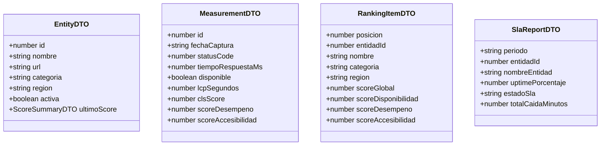

# Especificación Técnica: Backend Core REST API y Exportación de Reportes (`apps/api`)

* **Identificador de Especificación:** SDD-MOD-003
* **Versión:** 1.0.0
* **Estado:** Aprobado para Implementación
* **Requerimientos Asociados:** RF-010, RF-011, RF-013 | RNF-001, RNF-004, RNF-005, RNF-007, RNF-009, RNF-011
* **Decisiones Arquitectónicas Vinculadas:** ADR-0001 (Bun), ADR-0003 (PostgreSQL), ADR-0007 (Docker)

---

## 1. OBJETIVO Y CONTEXTO

### 1.1. Definición del Problema de Negocio
Para que la ciudadanía, investigadores y funcionarios públicos puedan auditar y consumir los datos de calidad digital de los portales del Estado peruano, se requiere una interfaz programática (API REST) estandarizada, de alta velocidad y baja latencia (≤ 500 ms según RNF-001). Asimismo, se requiere la capacidad de exportar masivamente los datos históricos en formatos abiertos (CSV y JSON según RF-013 y RNF-009).

Este módulo define la capa de servicios HTTP construida sobre el runtime **Bun** (ADR-0001), exponiendo contratos RESTful limpios, paginados y filtrables sobre el catálogo de 90 entidades, sus series temporales de telemetría, evaluaciones de SLAs e incidentes de servicio.

### 1.2. Alcance del Módulo

#### A. QUÉ ESTÁ INCLUIDO (In-Scope)
1. **Servidor HTTP Nativo en Bun:** Arquitectura liviana y de alto rendimiento utilizando `Bun.serve` o microframework compatible con tipado estricto.
2. **Endpoints de Catálogo y Fichas Técnicas (RF-011):** Listado paginado de entidades con filtros por categoría y región, y detalle individual con metadatos.
3. **Endpoints de Métricas y Series Temporales:** Consulta de telemetría histórica (`mediciones_crudas`) con rango de fechas y granularidad.
4. **Endpoints de Rankings y Scores (RF-010):** Consulta del ranking general de entidades ordenado por `score_global` o por sub-scores específicos.
5. **Endpoints de SLAs e Incidentes ITIL v4 (RF-012):** Consulta del estado mensual de SLAs y registro de incidentes de disponibilidad.
6. **Motor de Exportación de Reportes (RF-013, RNF-009):** Generación en streaming de archivos CSV y payloads JSON estructurados listos para descarga.
7. **Seguridad y Control de Acceso (RNF-004):** Acceso público de solo lectura a endpoints analíticos y protección mediante API Key / Bearer Token para endpoints administrativos (ej. disparo manual de auditorías).

#### B. QUÉ QUEDA EXCLUIDO (Out-of-Scope)
1. Renderizado de componentes HTML (responsabilidad del Frontend Astro SDD-MOD-004).
2. Sondeo HTTP directo a sitios de terceros (responsabilidad del Collector SDD-MOD-001).

---

## 2. MODELO DE DOMINIO Y DTOs (Data Transfer Objects)



---

## 3. REQUISITOS FUNCIONALES Y CONTRATOS DE API REST

Todos los endpoints tienen el prefijo `/api/v1`. Las respuestas exitosas devuelven JSON con la estructura estándar:
```json
{
  "success": true,
  "data": {},
  "meta": { "timestamp": "2026-09-27T20:00:00.000Z", "total": 90 }
}
```
En caso de error:
```json
{
  "success": false,
  "error": { "code": "NOT_FOUND", "message": "Entidad no encontrada con ID 999" }
}
```

---

### 3.1. Especificación de Endpoints

#### Endpoint 1: Listar Catálogo de Entidades
* **Ruta:** `GET /api/v1/entities`
* **Descripción:** Retorna la lista de entidades públicas monitoreadas con soporte de filtros.
* **Query Params:**
  - `categoria` (opcional): `'Ministerio' | 'GORE' | 'Organismo Autónomo' | 'Municipalidad Provincial'`
  - `region` (opcional): string (ej. `'Cusco'`, `'Lima'`)
  - `activa` (opcional): boolean (por defecto `true`)
* **Código HTTP:** `200 OK`
* **Ejemplo de Respuesta:**
```json
{
  "success": true,
  "data": [
    {
      "id": 1,
      "nombre": "Presidencia del Consejo de Ministros (PCM)",
      "url": "https://www.gob.pe/pcm",
      "categoria": "Ministerio",
      "region": null,
      "activa": true,
      "ultimoScore": {
        "scoreGlobal": 88.5,
        "fecha": "2026-09-27"
      }
    }
  ],
  "meta": { "total": 90, "page": 1, "pageSize": 100 }
}
```

---

#### Endpoint 2: Ficha Técnica Detallada de una Entidad
* **Ruta:** `GET /api/v1/entities/:id`
* **Descripción:** Retorna el detalle exhaustivo de una entidad, incluyendo sus últimas métricas y resumen de incidentes.
* **Parámetros de Ruta:** `id` (entero obligatorio).
* **Códigos HTTP:** `200 OK`, `404 Not Found`.
* **Ejemplo de Respuesta:**
```json
{
  "success": true,
  "data": {
    "id": 1,
    "nombre": "Presidencia del Consejo de Ministros (PCM)",
    "url": "https://www.gob.pe/pcm",
    "categoria": "Ministerio",
    "region": null,
    "activa": true,
    "scoreActual": {
      "scoreGlobal": 88.5,
      "scoreDisponibilidad": 100.0,
      "scoreDesempeno": 82.0,
      "scoreAccesibilidad": 83.5,
      "posicionRanking": 4
    },
    "slaMesActual": {
      "periodo": "2026-09",
      "uptimePorcentaje": 99.85,
      "estadoSla": "CUMPLE"
    },
    "incidentesActivos": 0
  }
}
```

---

#### Endpoint 3: Historial de Telemetría (Series Temporales)
* **Ruta:** `GET /api/v1/entities/:id/metrics`
* **Descripción:** Retorna la serie temporal de mediciones crudas de una entidad para graficación.
* **Query Params:**
  - `from` (opcional, formato ISO `YYYY-MM-DD`): Fecha inicio.
  - `to` (opcional, formato ISO `YYYY-MM-DD`): Fecha fin.
  - `limit` (opcional, entero, defecto 30, máx 365).
* **Código HTTP:** `200 OK`.
* **Ejemplo de Respuesta:**
```json
{
  "success": true,
  "data": [
    {
      "id": 1045,
      "fechaCaptura": "2026-09-27T06:00:00.000Z",
      "statusCode": 200,
      "tiempoRespuestaMs": 345.2,
      "disponible": true,
      "lcpSegundos": 2.1,
      "clsScore": 0.04,
      "scoreDesempeno": 85,
      "scoreAccesibilidad": 92
    }
  ],
  "meta": { "count": 1 }
}
```

---

#### Endpoint 4: Tabla de Ranking de Calidad Digital
* **Ruta:** `GET /api/v1/rankings`
* **Descripción:** Retorna la tabla clasificada de entidades de mayor a menor puntaje global.
* **Query Params:**
  - `categoria` (opcional): Filtro por categoría.
  - `region` (opcional): Filtro por región.
  - `orderBy` (opcional): `'scoreGlobal' | 'scoreDisponibilidad' | 'scoreDesempeno' | 'scoreAccesibilidad'` (defecto `scoreGlobal`).
* **Código HTTP:** `200 OK`.

---

#### Endpoint 5: Exportación Masiva de Datos (CSV / JSON)
* **Ruta:** `GET /api/v1/reports/export`
* **Descripción:** Genera y descarga un reporte consolidado con todas las métricas de las 90 entidades en el formato solicitado.
* **Query Params:**
  - `format` (obligatorio): `'csv' | 'json'`
  - `from` (opcional): Fecha inicial (defecto: últimos 30 días).
  - `to` (opcional): Fecha final.
  - `categoria` (opcional): Filtro institucional.
* **Cabeceras de Respuesta HTTP (para `format=csv`):**
  - `Content-Type: text/csv; charset=utf-8`
  - `Content-Disposition: attachment; filename="reporte_calidad_digital_20260927.csv"`
* **Estructura de Columnas CSV:**
  `entidad_id,nombre_entidad,categoria,region,fecha_captura,status_code,tiempo_respuesta_ms,disponible,lcp_segundos,cls_score,score_desempeno,score_accesibilidad,score_global`

---

#### Endpoint 6: Disparo Manual de Auditoría (Admin)
* **Ruta:** `POST /api/v1/collector/trigger`
* **Descripción:** Dispara una ejecución en segundo plano del colector de telemetría.
* **Cabeceras:** `Authorization: Bearer <ADMIN_API_KEY>`
* **Códigos HTTP:** `202 Accepted`, `401 Unauthorized`, `429 Too Many Requests` (si ya hay una ejecución en curso).
* **Ejemplo de Respuesta:**
```json
{
  "success": true,
  "message": "Auditoría iniciada en background para 90 entidades",
  "jobId": "job-20260927-001"
}
```

---

## 4. ARQUITECTURA Y REGLAS DE NEGOCIO

### 4.1. Restricciones Técnicas
1. **Rendimiento ≤ 500 ms (RNF-001):** Toda consulta a `/api/v1/rankings` y `/api/v1/entities` debe utilizar índices relacionales (`idx_mediciones_entidad_fecha`, `idx_entidades_categoria_region`) para garantizar tiempos de respuesta menores a 100 ms en el 95% de las llamadas.
2. **Streaming en Exportación CSV:** Para exportaciones de grandes volúmenes históricos, el backend debe generar el CSV como un `ReadableStream` directamente desde el cursor de PostgreSQL, sin cargar todos los registros en memoria RAM.
3. **CORS y Seguridad:**
   - Cabeceras CORS configuradas con `Access-Control-Allow-Origin: *` para endpoints de solo lectura.
   - Cabeceras de seguridad estrictas: `X-Content-Type-Options: nosniff`, `X-Frame-Options: DENY`.
4. **Validación de Parámetros:** Esquemas de validación estrictos mediante librerías tipadas (`Zod` o `TypeBox`) que rechacen entradas maliciosas o tipos inválidos con `400 Bad Request`.

---

## 5. CRITERIOS DE ACEPTACIÓN Y PRUEBAS (TDD)

### Escenario 1: Consulta Exitosa de Rankings con Filtro por Categoría
* **Dado que** existen 20 entidades de categoría `'Ministerio'` con scores calculados.
* **Cuando** un cliente realiza una petición `GET /api/v1/rankings?categoria=Ministerio`.
* **Entonces** el servidor debe responder con código HTTP 200 OK en menos de 200 ms.
* **Y** el cuerpo de respuesta debe contener exactamente 20 elementos, ordenados descendentemente por `scoreGlobal`.
* **Y** cada elemento debe pertenecer exclusivamente a la categoría `'Ministerio'`.

### Escenario 2: Descarga de Reporte en Formato CSV
* **Dado que** existen registros históricos en el rango de fechas solicitado.
* **Cuando** un usuario solicita `GET /api/v1/reports/export?format=csv`.
* **Entonces** la cabecera `Content-Type` debe ser `text/csv; charset=utf-8`.
* **Y** la primera línea del archivo debe contener los encabezados exactos de las columnas.
* **Y** el código de respuesta debe ser 200 OK.

### Escenario 3: Rechazo de Disparo de Auditoría sin Credenciales
* **Dado que** el endpoint `POST /api/v1/collector/trigger` está protegido.
* **Cuando** se realiza la petición sin la cabecera `Authorization`.
* **Entonces** el servidor debe retornar inmediatamente código HTTP 401 Unauthorized.
* **Y** no se debe iniciar ningún proceso de recolección en segundo plano.
