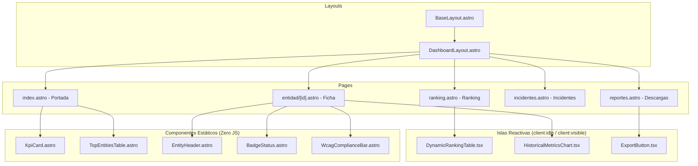

# Especificación Técnica: Frontend Dashboard y Sistema de Diseño Accesible (`apps/dashboard`)

* **Identificador de Especificación:** SDD-MOD-004
* **Versión:** 1.0.0
* **Estado:** Aprobado para Implementación
* **Requerimientos Asociados:** RF-010, RF-011 | RNF-002, RNF-006, RNF-007, RNF-010, RNF-011
* **Decisiones Arquitectónicas Vinculadas:** ADR-0001 (Bun), ADR-0002 (Astro), ADR-0004 (CSS Puro), ADR-0007 (Docker)

---

## 1. OBJETIVO Y CONTEXTO

### 1.1. Definición del Problema de Negocio
La información sobre el desempeño tecnológico y la accesibilidad de los portales gubernamentales debe ser accesible para toda la ciudadanía, incluidos usuarios con discapacidad visual o motriz y personas con conexiones de baja velocidad en distintas regiones del Perú. Los dashboards convencionales basados en aplicaciones pesadas de una sola página (SPAs) introducen dependencias sobredimensionadas de JavaScript que degradan el tiempo de carga y vulneran las pautas de accesibilidad WCAG 2.1 AA.

Este módulo especifica la construcción del **Dashboard Web** utilizando **Astro Framework** (ADR-0002) y **CSS Puro** (ADR-0004), garantizando:
- Tiempo de carga inicial $\le 3\text{ segundos}$ en redes 4G estándar (RNF-002).
- Cumplimiento estricto del estándar **WCAG 2.1 nivel AA** (RNF-006).
- Arquitectura de islas (*Islands Architecture*) con Cero JavaScript por defecto para el contenido estático.

### 1.2. Alcance del Módulo

#### A. QUÉ ESTÁ INCLUIDO (In-Scope)
1. **Páginas Principales del Dashboard (RF-010, RF-011):**
   - **`/` (Resumen Ejecutivo):** Indicadores clave de rendimiento (KPIs globales de disponibilidad media, velocidad y accesibilidad) y Top 10 de entidades con mejor y peor desempeño.
   - **`/ranking` (Ranking Nacional Completo):** Tabla interactiva con las 90 entidades, con filtros combinados por categoría (Ministerio, GORE, etc.) y región, y ordenamiento dinámico por columnas.
   - **`/entidad/[id]` (Ficha Técnica Institucional):** Vista detallada de una entidad con semáforo de SLA, evolución histórica de Core Web Vitals en gráficos de líneas y detalle de violaciones de accesibilidad.
   - **`/incidentes` (Tablero de Incidentes ITIL v4):** Panel de caídas activas en tiempo real y registro histórico de indisponibilidad.
   - **`/reportes` (Centro de Descargas):** Interfaz para exportar reportes en CSV y JSON con selector de fechas y filtros institucionales.
2. **Sistema de Diseño en CSS Puro (`src/styles/`):**
   - Variables CSS (*Design Tokens*) para tipografía accesible, espaciado proporcional, sombras y paleta de colores con contraste garantizado $\ge 4.5:1$ (texto normal) y $\ge 3:1$ (elementos de interfaz).
   - Componentes UI modulares nativos sin dependencias externas (Bootstrap, Tailwind, etc.).
3. **Accesibilidad Integral (WCAG 2.1 AA):** Enlaces de salto al contenido (*skip-links*), navegación 100% operable por teclado, foco visible con alto contraste, marcado semántico HTML5 y atributos ARIA rigurosos.

#### B. QUÉ QUEDA EXCLUIDO (Out-of-Scope)
1. Autenticación de usuarios ciudadanos (el dashboard es 100% público y abierto).
2. Paneles de edición manual de datos en el cliente.

---

## 2. MODELO DE COMPONENTES Y SISTEMA DE DISEÑO

### 2.1. Jerarquía de Componentes Astro e Islas



### 2.2. Sistema de Tokens CSS (`src/styles/tokens.css`)

```css
:root {
  /* Paleta de Colores Institucional - Contraste WCAG 2.1 AA */
  --color-bg-primary: #FFFFFF;
  --color-bg-secondary: #F8F9FA;
  --color-bg-surface: #FFFFFF;
  --color-border: #D1D5DB;

  --color-text-primary: #111827;    /* Contraste 15.3:1 sobre blanco */
  --color-text-secondary: #374151;  /* Contraste 9.3:1 sobre blanco */
  --color-text-muted: #4B5563;      /* Contraste 7.0:1 sobre blanco */

  /* Colores Semánticos de Estado */
  --color-success-bg: #DCFCE7;
  --color-success-text: #14532D;   /* Contraste 8.4:1 */
  --color-warning-bg: #FEF3C7;
  --color-warning-text: #78350F;   /* Contraste 8.6:1 */
  --color-danger-bg: #FEE2E2;
  --color-danger-text: #7F1D1D;    /* Contraste 9.5:1 */
  --color-info-bg: #E0F2FE;
  --color-info-text: #075985;

  /* Identidad y Enfoque Accesible */
  --color-brand-primary: #003366;  /* Azul institucional (Contraste 12.6:1) */
  --color-brand-accent: #B91C1C;   /* Rojo estatal (Contraste 5.9:1) */
  --color-focus-ring: #2563EB;     /* Anillo de foco de 3px */

  /* Tipografía Escalar (Fluid Typography) */
  --font-sans: system-ui, -apple-system, BlinkMacSystemFont, "Segoe UI", Roboto, Oxygen, Ubuntu, Cantarell, sans-serif;
  --font-mono: ui-monospace, SFMono-Regular, Menlo, Monaco, Consolas, monospace;
  --text-xs: 0.75rem;   /* 12px */
  --text-sm: 0.875rem;  /* 14px */
  --text-base: 1.0rem;  /* 16px */
  --text-lg: 1.125rem;  /* 18px */
  --text-xl: 1.25rem;   /* 20px */
  --text-2xl: 1.5rem;   /* 24px */
  --text-3xl: 2.0rem;   /* 32px */

  /* Espaciado Proporcional (Múltiplos de 4px / 8px) */
  --space-1: 0.25rem;
  --space-2: 0.5rem;
  --space-3: 0.75rem;
  --space-4: 1.0rem;
  --space-6: 1.5rem;
  --space-8: 2.0rem;
  --space-12: 3.0rem;

  /* Layout y Contenedores */
  --container-max-width: 1200px;
  --radius-sm: 4px;
  --radius-md: 8px;
}
```

---

## 3. ESPECIFICACIÓN DE PÁGINAS Y VISTAS

### 3.1. Vista 1: Portada y Resumen Ejecutivo (`src/pages/index.astro`)
* **Propósito:** Ofrecer un diagnóstico global instantáneo del estado de la calidad digital en el Perú.
* **Componentes Renderizados:**
  1. **Sección Hero:** Título normativo del Observatorio, fecha de la última auditoría sincronizada y botón de acceso al ranking completo.
  2. **Barra de KPIs Globales:**
     - **Disponibilidad Promedio:** (ej. $98.4\%$).
     - **Velocidad LCP Promedio:** (ej. $3.2\text{s}$).
     - **Accesibilidad Media:** (ej. $78/100$).
     - **Incidentes Activos:** (ej. $2\text{ portales caídos}$).
  3. **Top 5 Mejores y Top 5 Más Críticos:** Tarjetas con las entidades destacadas y sus puntuaciones.

---

### 3.2. Vista 2: Ranking Nacional Interactivo (`src/pages/ranking.astro`)
* **Propósito:** Permitir a ciudadanos y evaluadores explorar, ordenar y filtrar los 90 portales estatales.
* **Componente Reactivo:** `DynamicRankingTable.tsx` (Hidratado con `client:idle`).
* **Funcionalidades de la Tabla:**
  - **Filtros Combinados:** Selector de Categoría (`Todas`, `Ministerios`, `GOREs`, `Organismos Autónomos`, `Municipalidades`) y Selector de Región.
  - **Buscador Instantáneo:** Búsqueda en tiempo real por nombre de entidad o URL.
  - **Ordenamiento por Columnas:** Posición, Nombre, Score Global, Disponibilidad, Rendimiento, Accesibilidad.
  - **Accesibilidad en Tabla:** Encabezados `<th scope="col">` con atributos `aria-sort="ascending|descending"`, soporte completo de navegación con flechas de teclado.

---

### 3.3. Vista 3: Ficha Técnica Institucional (`src/pages/entidad/[id].astro`)
* **Propósito:** Mostrar la radiografía tecnológica individual de un portal seleccionado.
* **Secciones de la Ficha:**
  1. **Cabecera Institucional:** Nombre, URL con enlace saliente seguro (`rel="noopener noreferrer"`), categoría, región y etiqueta de estado en vivo (`BadgeStatus`).
  2. **Medidor de Cumplimiento de SLA Mensual:** Indicador gráfico del uptime mensual acumulado frente a la meta del $99.5\%$.
  3. **Gráficos de Tendencia Histórica:** Componente `HistoricalMetricsChart.tsx` (con `client:visible`), graficando la serie temporal de 30 días de LCP, latencia HTTP y puntajes.
  4. **Panel de Accesibilidad y Hallazgos WCAG 2.1:** Listado desplegable con cada auditoría fallida, selector CSS y recomendación de solución técnica.

---

## 4. CONTRATOS DE PROPS DE COMPONENTES (TypeScript)

```typescript
// src/components/ui/KpiCard.astro
export interface KpiCardProps {
  title: string;
  value: string | number;
  unit?: string;
  trend?: 'up' | 'down' | 'neutral';
  trendValue?: string;
  status?: 'success' | 'warning' | 'danger';
  iconName?: string;
}

// src/components/ui/BadgeStatus.astro
export interface BadgeStatusProps {
  status: 'ONLINE' | 'OFFLINE' | 'DEGRADED';
  label?: string;
}

// src/islands/DynamicRankingTable.tsx
export interface RankingEntity {
  id: number;
  posicion: number;
  nombre: string;
  url: string;
  categoria: string;
  region: string | null;
  scoreGlobal: number;
  scoreDisponibilidad: number;
  scoreDesempeno: number;
  scoreAccesibilidad: number;
  estadoSla: 'CUMPLE' | 'EN_RIESGO' | 'INCUMPLE';
}

export interface DynamicRankingTableProps {
  initialEntities: RankingEntity[];
  lastUpdated: string;
}
```

---

## 5. ARQUITECTURA Y REGLAS DE ACCESIBILIDAD

### 5.1. Reglas Técnicas de Accesibilidad (WCAG 2.1 AA)
1. **Marcado Semántico Obligatorio:** Toda página debe contener exactamente un elemento `<main id="main-content">`, una cabecera `<header>`, navegación `<nav aria-label="...">` y pie de página `<footer>`.
2. **Enlace de Salto (*Skip Link*):** El primer elemento focable del DOM en todas las páginas debe ser:
   ```html
   <a href="#main-content" class="skip-link">Saltar al contenido principal</a>
   ```
3. **Indicador de Foco Visible:** Queda terminantemente prohibido el uso de `outline: none;` sin un reemplazo visual explícito. Se debe aplicar:
   ```css
   :focus-visible {
     outline: 3px solid var(--color-focus-ring);
     outline-offset: 2px;
   }
   ```
4. **Cero Texto en Imágenes:** Toda información debe presentarse como texto seleccionable con fuentes del sistema de alta legibilidad.
5. **Comportamiento ante Desactivación de JavaScript:** Toda la información clave (KPIs, lista de entidades y fichas técnicas) debe ser completamente visible y navegable con JavaScript deshabilitado. Las islas reactivas solo enriquecen la experiencia con ordenamiento y filtrado instantáneo.

---

## 6. CRITERIOS DE ACEPTACIÓN Y PRUEBAS (TDD / A11Y)

### Escenario 1: Carga Ultrarrápida y Lighthouse Performance
* **Dado que** el dashboard está desplegado en un servidor de producción.
* **Cuando** se audita la página de inicio `/` mediante Google Lighthouse en modo móvil.
* **Entonces** el puntaje de Rendimiento (Performance) debe ser $\ge 90/100$.
* **Y** el Largest Contentful Paint (LCP) debe ser $\le 2.0\text{ segundos}$.
* **Y** el peso total de la carga inicial de JavaScript transferido debe ser $\le 50\text{ KB}$.

### Escenario 2: Cumplimiento de Accesibilidad Automatizada
* **Dado que** se ejecutan pruebas automatizadas con `@axe-core/playwright` sobre todas las rutas (`/`, `/ranking`, `/entidad/1`, `/incidentes`).
* **Cuando** se completa el escaneo de violaciones WCAG 2.1 AA.
* **Entonces** la suite de pruebas debe reportar **0 violaciones críticas**, **0 violaciones serias** y **0 fallos de contraste de color**.

### Escenario 3: Navegación y Filtros Operables por Teclado
* **Dado que** un usuario navega en `/ranking` utilizando únicamente la tecla `Tab` y flechas direccionales.
* **Cuando** interactúa con el selector de categorías y presiona `Enter` sobre `'Ministerio'`.
* **Entonces** el foco debe permanecer en una posición lógica y accesible.
* **Y** la tabla debe actualizarse mostrando únicamente los 20 ministerios sin recargar la página completa.
