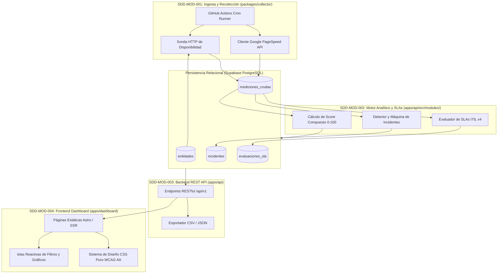

# Especificaciones Técnicas (SDD) - Observatorio de Calidad Digital Pública

* **Proyecto:** Observatorio de Calidad Digital Pública (Perú)
* **Metodología:** Spec-Driven Development (SDD) & Test-Driven Development (TDD)
* **Stack Oficial:** Bun + Astro + PostgreSQL (Supabase) + CSS Puro + GitHub Actions + Google APIs + Docker
* **Ruta de Especificaciones:** `./docs/SDD/`
* **Fecha de Emisión:** 2026-09-27
* **Estado:** Aprobado para Codificación Asistida por IA y Desarrollo Humano

---

## 1. Visión General y Mapa de Módulos (SDD)

El conjunto de especificaciones técnicas formaliza la arquitectura del Observatorio en **4 módulos desacoplados y autocontenidos**, eliminando ambigüedades técnicas y sirviendo como **Fuente Única de Verdad (Single Source of Truth)** para herramientas como Claude Code, Codex, Cursor o desarrolladores de software.

---

## 2. Índice de Especificaciones Técnicas

| Documento | Módulo / Componente | Requerimientos Clave | Descripción y Enfoque |
| :--- | :--- | :--- | :--- |
| [**01-collector-ingesta.spec.md**](./01-collector-ingesta.spec.md) | **Módulo de Recolección y Telemetría Cruda** (`packages/collector`) | RF-001, RF-002, RF-003, RF-004, RF-005 | Sonda HTTP de uptime/latencia, auditoría Google PageSpeed (Core Web Vitals & WCAG 2.1), rate-limiting y persistencia inmutable en PostgreSQL. |
| [**02-analytics-slas-incidentes.spec.md**](./02-analytics-slas-incidentes.spec.md) | **Motor Analítico de Calidad, SLAs e Incidentes** (`apps/api/core`) | RF-006, RF-007, RF-008, RF-009, RF-012 | Algoritmo de ponderación (40/30/30), normalización de métricas, máquina de estados de incidentes ITIL v4 y evaluación de acuerdos de nivel de servicio. |
| [**03-backend-api-reportes.spec.md**](./03-backend-api-reportes.spec.md) | **Backend Core REST API y Reportes** (`apps/api`) | RF-010, RF-011, RF-013, RNF-001, RNF-004 | Endpoints REST de alta velocidad en Bun (≤ 500 ms), contratos de fichas técnicas, rankings, filtrado y generación en streaming de CSV/JSON. |
| [**04-frontend-dashboard.spec.md**](./04-frontend-dashboard.spec.md) | **Frontend Dashboard y Sistema de Diseño** (`apps/dashboard`) | RF-010, RF-011, RNF-002, RNF-006 | Interfaz pública en Astro, arquitectura de islas (Zero JS por defecto), sistema de tokens en CSS Puro y accesibilidad estricta WCAG 2.1 AA. |

---

## 3. Matriz de Trazabilidad Completa (Requerimientos vs. SDDs)

| ID Requerimiento | Tipo | Descripción Resumida | SDD Responsable | ADR Relacionado |
| :--- | :---: | :--- | :---: | :---: |
| **RF-001** | Funcional | Extracción y gestión de catálogo de 90 URLs | `01-collector-ingesta.spec.md` | ADR-0003 |
| **RF-002** | Funcional | Sonda de disponibilidad (Uptime) y latencia HTTP | `01-collector-ingesta.spec.md` | ADR-0001 |
| **RF-003** | Funcional | Auditoría de velocidad y Core Web Vitals | `01-collector-ingesta.spec.md` | ADR-0006 |
| **RF-004** | Funcional | Auditoría de accesibilidad según WCAG 2.1 AA | `01-collector-ingesta.spec.md` | ADR-0006 |
| **RF-005** | Funcional | Clasificación por categoría y región geográfica | `01-collector-ingesta.spec.md` | ADR-0003 |
| **RF-006** | Funcional | Cálculo de puntaje global de cumplimiento (0-100) | `02-analytics-slas-incidentes.spec.md` | ADR-0003 |
| **RF-007** | Funcional | Normalización determinista de métricas técnicas | `02-analytics-slas-incidentes.spec.md` | ADR-0001 |
| **RF-008** | Funcional | Detección estadística de anomalías y degradación | `02-analytics-slas-incidentes.spec.md` | ADR-0001 |
| **RF-009** | Funcional | Agregación de metadatos, series temporales y notas | `02-analytics-slas-incidentes.spec.md` | ADR-0003 |
| **RF-010** | Funcional | Dashboard interactivo con rankings y filtros | `04-frontend-dashboard.spec.md` | ADR-0002, ADR-0004 |
| **RF-011** | Funcional | Ficha técnica e historial individual por portal | `04-frontend-dashboard.spec.md` | ADR-0002, ADR-0004 |
| **RF-012** | Funcional | Gestión de incidentes y SLAs según marco ITIL v4 | `02-analytics-slas-incidentes.spec.md` | ADR-0003 |
| **RF-013** | Funcional | Generación y exportación de reportes CSV / JSON | `03-backend-api-reportes.spec.md` | ADR-0001 |
| **RNF-001** | No Funcional | Tiempo de respuesta del backend $\le 500\text{ ms}$ | `03-backend-api-reportes.spec.md` | ADR-0001 |
| **RNF-002** | No Funcional | Carga inicial del dashboard frontend $\le 3\text{ s}$ | `04-frontend-dashboard.spec.md` | ADR-0002 |
| **RNF-003** | No Funcional | Capacidad para 90 entidades con 1 año de historial | `01-collector-ingesta.spec.md` | ADR-0003 |
| **RNF-004** | No Funcional | Autenticación y permisos de endpoints protegidos | `03-backend-api-reportes.spec.md` | ADR-0001 |
| **RNF-005** | No Funcional | Cifrado y resguardo de credenciales sensibles | `01-collector-ingesta.spec.md` | ADR-0005 |
| **RNF-006** | No Funcional | Accesibilidad estricta WCAG 2.1 AA (contraste $\ge 4.5:1$) | `04-frontend-dashboard.spec.md` | ADR-0004 |
| **RNF-007** | No Funcional | Modularidad y cobertura de pruebas unitarias $\ge 80\%$ | Todos los módulos | ADR-0001, ADR-0007 |
| **RNF-009** | No Funcional | Interoperabilidad con APIs externas y exportación abierta | `01-collector-ingesta.spec.md`, `03-backend-api-reportes.spec.md` | ADR-0006 |
| **RNF-010** | No Funcional | Cumplimiento de Ley D.L. 1412 y normas de accesibilidad | `02-analytics-slas-incidentes.spec.md`, `04-frontend-dashboard.spec.md` | ADR-0004 |
| **RNF-011** | No Funcional | Costos operativos $\le \$50\text{ USD/mes}$ (Serverless/Free Tier) | `01-collector-ingesta.spec.md` | ADR-0005 |

---

## 4. Guía de Implementación para Agentes de IA y Desarrolladores

1. **Orden de Implementación Secuencial:**
   - **Paso 1:** Implementar el paquete `packages/collector` siguiendo estrictamente `01-collector-ingesta.spec.md`.
   - **Paso 2:** Crear la suite de pruebas unitarias de ingesta con `bun test`.
   - **Paso 3:** Implementar el motor de dominio y servicios en `apps/api/src/modules/` siguiendo `02-analytics-slas-incidentes.spec.md`.
   - **Paso 4:** Exponer los endpoints HTTP y exportadores siguiendo `03-backend-api-reportes.spec.md`.
   - **Paso 5:** Desarrollar las vistas y componentes de `apps/dashboard` siguiendo `04-frontend-dashboard.spec.md`.
2. **Convenciones de Código:**
   - Todo el código debe estar escrito en **TypeScript** en modo estricto (`"strict": true`).
   - Sin librerías CSS pesadas (únicamente `tokens.css` y CSS puro nativo).
   - Sin dependencias de Node.js donde existan APIs nativas de **Bun** (`Bun.serve`, `fetch`, `Bun.password`, etc.).
