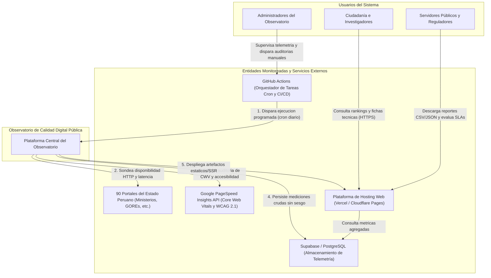
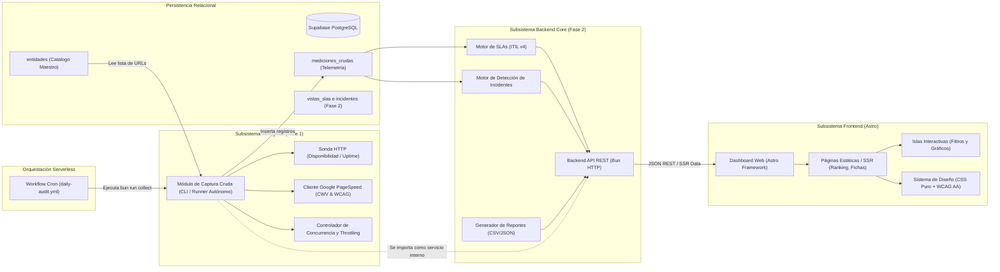
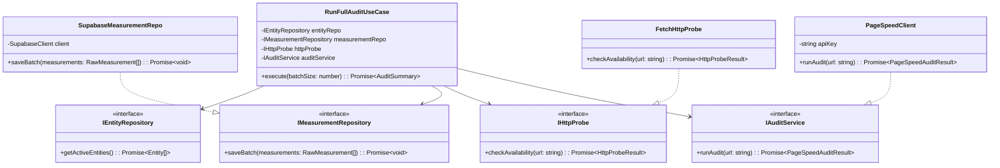

# Arquitectura del Sistema - Observatorio de Calidad Digital Pública

* **Documento:** Especificación Arquitectónica en 3 Niveles
* **Fecha:** 2026-09-27
* **Estado:** Aprobado
* **Relación con ADRs:** ADR-0001 (Bun), ADR-0002 (Astro), ADR-0003 (PostgreSQL/Supabase), ADR-0004 (CSS Puro), ADR-0005 (GitHub Actions), ADR-0006 (Google APIs), ADR-0007 (Docker).

---

## 1. Visión General y Principio de Desacoplamiento

La arquitectura del sistema está diseñada para resolver la necesidad inmediata: **recolectar telemetría cruda y objetiva de 90 portales del Estado peruano de forma diaria y desatendida desde el primer momento**, desacoplando la fase de captura temprana del desarrollo posterior del backend analítico y del dashboard frontend.

```
┌────────────────────────────────────────────────────────────────────────┐
│                          EVOLUCIÓN EN 2 FASES                          │
│                                                                        │
│   FASE 1 (Inmediata):                                                  │
│   [GitHub Actions (Cron)] ──▶ [Módulo Captura Cruda] ──▶ [Supabase DB] │
│                                                                        │
│   FASE 2 (Backend + Dashboard):                                        │
│   [Módulo Captura] ──(Se integra en)──▶ [Backend Core API (Bun)]       │
│                                                   │                    │
│                                                   ▼                    │
│                                         [Dashboard (Astro)]            │
└────────────────────────────────────────────────────────────────────────┘
```

---

## 2. Nivel 1: Arquitectura de Contexto e Interacción Global

Representa cómo interactúan los usuarios, el sistema central del Observatorio y todos los servicios externos (sensores, APIs de auditoría, base de datos e infraestructura de despliegue).

### Diagrama de Contexto (Mermaid)



### Descripción de Flujos de Nivel 1
1. **Orquestación Desatendida:** GitHub Actions despierta diariamente el proceso de recolección según el cron configurado.
2. **Sondeo Directo:** El sistema realiza peticiones HTTP a los 90 portales para verificar estado (200, 404, 500) y tiempos de respuesta.
3. **Auditoría Externa Estandarizada:** El sistema consulta a Google PageSpeed Insights API para obtener de forma imparcial los Core Web Vitals (LCP, FID/INP, CLS) y el puntaje WCAG 2.1.
4. **Persistencia Centralizada:** Toda la telemetría se guarda en la base de datos PostgreSQL alojada en Supabase.
5. **Consulta Pública:** La ciudadanía y los servidores públicos acceden al dashboard en Astro servido en la CDN con velocidad ultrarrápida y diseño accesible.

---

## 3. Nivel 2: Arquitectura de Contenedores y Módulos

Desglosa los subsistemas que componen el Observatorio, delimitando sus responsabilidades, protocolos de comunicación y almacenamiento.

### Diagrama de Módulos (Mermaid)



### Responsabilidades de los Módulos de Nivel 2
* **Módulo de Captura Cruda:** Módulo autónomo y prioritario. Lee las 90 entidades de la base de datos, ejecuta las comprobaciones de disponibilidad en paralelo controlado, procesa las auditorías de Google con rate-limiting y guarda los resultados crudos en Supabase.
* **Supabase PostgreSQL:** Almacén único de la verdad. Implementa las tablas de Fase 1 con llaves foráneas e índices temporales de alto rendimiento.
* **Backend Core (Bun):** En Fase 2 proporciona la lógica analítica: evalúa umbrales de SLA, clasifica incidentes por continuidad de caída, expone endpoints REST seguros y genera reportes en CSV y JSON.
* **Frontend (Astro):** Interfaz pública optimizada para rendimiento (LCP < 1.5s, cero JavaScript innecesario). Utiliza componentes estáticos para el contenido y *islas* reactivas exclusivamente para filtros y gráficos dinámicos.

---

## 4. Nivel 3: Arquitectura de Código y Componentes

Define la estructura de directorios, capas y contratos de código para los tres componentes de software: el **Módulo de Captura Cruda**, el **Backend** y el **Frontend**.

```
GSTI_project/
├── .github/
│   └── workflows/
│       └── daily-audit.yml              # Orquestador programado de recolección
├── packages/
│   └── collector/                       # MÓDULO DE CAPTURA CRUDA (Fase 1 - Prioritario)
├── apps/
│   ├── api/                             # BACKEND CORE (Fase 2)
│   └── dashboard/                       # FRONTEND ASTRO (Fase 2)
└── docs/
    ├── ADRs/
    ├── architecture/
    └── schemes/
```

---

### 4.1. Módulo de Captura Cruda (`packages/collector`) — *Prioridad 1*

Este módulo está diseñado con **Arquitectura Hexagonal (Puertos y Adaptadores)**. Esto garantiza que funcione hoy de manera autónoma como un CLI en GitHub Actions y que mañana se importe directamente en el Backend sin tocar su lógica interna.

#### Estructura de Directorios

```
packages/collector/
├── package.json                         # Configurado con Bun
├── tsconfig.json
├── src/
│   ├── index.ts                         # Exportación pública del módulo para reuso en Backend
│   ├── cli.ts                           # Punto de entrada para ejecución por terminal / GitHub Actions
│   │
│   ├── core/                            # Dominio y Abstracciones (Independiente de librerías)
│   │   ├── models/
│   │   │   ├── entity.model.ts          # Interface de Entidad Pública
│   │   │   ├── probe-result.model.ts    # Modelo de telemetría HTTP cruda
│   │   │   └── audit-result.model.ts    # Modelo de Core Web Vitals y Accesibilidad
│   │   └── ports/
│   │       ├── entity-repository.port.ts # Contrato de lectura de entidades
│   │       ├── measurement-repository.port.ts # Contrato de inserción de métricas
│   │       ├── http-probe.port.ts       # Contrato de sondeo HTTP
│   │       └── audit-service.port.ts    # Contrato de auditoría PageSpeed
│   │
│   ├── infrastructure/                  # Adaptadores Tecnológicos
│   │   ├── http/
│   │   │   └── fetch-http-probe.ts      # Implementación con fetch nativo de Bun (timeout/latencia)
│   │   ├── google/
│   │   │   └── pagespeed-client.ts      # Cliente de Google PageSpeed Insights API v5 con reintentos
│   │   ├── persistence/
│   │   │   └── supabase-measurement-repo.ts # Adaptador PostgreSQL / Supabase (@supabase/supabase-js o pg)
│   │   └── config/
│   │       └── env.config.ts            # Validación de variables (SUPABASE_URL, GOOGLE_API_KEY)
│   │
│   └── application/                     # Casos de Uso / Orquestador
│       ├── run-full-audit.usecase.ts    # Orquestador del lote de 90 entidades
│       └── rate-limiter.ts              # Control de concurrencia (ej. 3 peticiones concurrentes con delay)
```

#### Diagrama de Clases y Contratos del Colector (Mermaid)



#### Integración Futura con el Backend
Cuando se construya el backend, la integración consistirá en una sola línea de importación:
```typescript
import { RunFullAuditUseCase } from '@observatorio/collector';
// Permite ejecutar auditorías desde un endpoint admin o desde el scheduler interno del backend
```

---

### 4.2. Backend (`apps/api`) — *Fase 2*

El backend provee servicios REST ligeros en Bun/TypeScript, calculando la lógica analítica de SLAs e incidentes sobre los datos persistidos en Supabase.

#### Estructura de Directorios

```
apps/api/
├── package.json                         # Runtime Bun
├── tsconfig.json
├── src/
│   ├── server.ts                        # Punto de entrada HTTP (Bun.serve o microframework liviano)
│   ├── config/
│   │   ├── database.ts                  # Pool de conexiones a PostgreSQL / Supabase
│   │   └── constants.ts                 # Umbrales de SLAs (ej: Uptime 99.5%, LCP 2.5s)
│   │
│   ├── modules/
│   │   ├── entities/                    # Catálogo de entidades
│   │   │   ├── entities.controller.ts
│   │   │   ├── entities.service.ts
│   │   │   └── entities.repository.ts
│   │   ├── metrics/                     # Series temporales de telemetría cruda
│   │   │   ├── metrics.controller.ts
│   │   │   └── metrics.service.ts
│   │   ├── slas/                        # Análisis de SLAs según ITIL v4 (Cálculo temporal)
│   │   │   ├── sla-calculator.service.ts
│   │   │   └── sla.controller.ts
│   │   ├── incidents/                  # Detección y ciclo de vida de caídas de servicio
│   │   │   ├── incident-detector.service.ts
│   │   │   └── incidents.controller.ts
│   │   ├── scoring/                     # Cálculo del puntaje normalizado (0-100)
│   │   │   └── score.service.ts
│   │   └── reports/                     # Exportación de reportes CSV / JSON
│   │       ├── csv-exporter.ts
│   │       └── reports.controller.ts
│   │
│   └── middlewares/
│       ├── error-handler.ts
│       ├── cors.ts
│       └── logger.ts
```

---

### 4.3. Frontend (`apps/dashboard`) — *Fase 2*

Construido en **Astro** para máxima velocidad de carga (RNF-002) y cumplimiento estricto de accesibilidad WCAG 2.1 nivel AA (RNF-006).

#### Estructura de Directorios

```
apps/dashboard/
├── astro.config.mjs                     # Configuración de Astro (modo SSR/SSG con Bun)
├── package.json
├── public/
│   ├── favicon.svg
│   └── assets/logos/
│
├── src/
│   ├── layouts/
│   │   ├── BaseLayout.astro             # Estructura HTML5 accesible (meta tags, skip links, aria)
│   │   └── DashboardLayout.astro        # Header gubernamental, sidebar/navbar y footer
│   │
│   ├── pages/
│   │   ├── index.astro                  # Resumen Ejecutivo (KPIs globales y Top 10)
│   │   ├── ranking.astro                # Tabla completa de las 90 entidades con filtros
│   │   ├── entidad/
│   │   │   └── [id].astro               # Ficha técnica individual y gráficos históricos
│   │   ├── incidentes.astro             # Tablero de alertas e incidentes (ITIL v4)
│   │   └── reportes.astro               # Panel de descarga de datos en CSV y JSON
│   │
│   ├── components/                      # Componentes Astro (Zero JS por defecto)
│   │   ├── ui/
│   │   │   ├── KpiCard.astro            # Tarjeta de métrica clave
│   │   │   ├── BadgeStatus.astro        # Indicador de estado (Disponible / Caído)
│   │   │   └── Breadcrumb.astro
│   │   └── entities/
│   │       ├── EntityHeader.astro
│   │       └── WcagComplianceBar.astro
│   │
│   ├── islands/                         # Islas Interactivas (React / Preact / Vanilla JS hidratado)
│   │   ├── DynamicRankingTable.tsx      # Tabla interactiva con ordenamiento y filtros por región
│   │   ├── HistoricalMetricsChart.tsx   # Gráfico de líneas (Uptime y Core Web Vitals)
│   │   └── ExportButton.tsx             # Disparador de descarga de reportes
│   │
│   ├── styles/                          # CSS Puro sin dependencias externas
│   │   ├── tokens.css                   # Custom Properties: paleta de colores WCAG AA, tipografía, espacios
│   │   ├── reset.css                    # Reseteo estándar de navegador
│   │   ├── layout.css                   # CSS Grid y Flexbox globales
│   │   └── components.css               # Estilos comunes no encapsulados
│   │
│   └── services/
│       ├── api-client.ts                # Conexión al backend o Supabase en tiempo de compilación/SSR
│       └── formatters.ts                # Formateo de fechas, milisegundos y puntajes
```

---

## 5. Matriz de Trazabilidad Arquitectónica

| Requerimiento | Nivel 1 (Contexto) | Nivel 2 (Módulos) | Nivel 3 (Componentes de Código) |
| :--- | :--- | :--- | :--- |
| **RF-001 (90 URLs)** | Conexión con portales | Catálogo `entidades` | `entity.model.ts`, `IEntityRepository` |
| **RF-002 (Uptime)** | Sondeo HTTP | Sonda HTTP | `FetchHttpProbe`, `probe-result.model.ts` |
| **RF-003 (CWV)** | Google PageSpeed API | Cliente PageSpeed | `PageSpeedClient`, `audit-result.model.ts` |
| **RF-004 (WCAG 2.1)** | Google PageSpeed API | Extractor de errores | `PageSpeedClient` (`errores_accesibilidad`) |
| **RF-010 (Dashboard)** | Hosting Web en CDN | Astro Framework | `apps/dashboard/src/pages/index.astro` |
| **RF-012 (ITIL v4)** | Consulta de incidentes | Motor de SLAs e Incidentes | `apps/api/src/modules/slas/`, `incidents/` |
| **RF-013 (Reportes)** | Descarga de archivos | Generador de Reportes | `apps/api/src/modules/reports/csv-exporter.ts` |
| **RNF-001 (Latencia Backend)** | Conexión directa | Runtime Bun nativo | `Bun.serve` con tiempos < 50 ms |
| **RNF-002 (Carga Frontend ≤ 3s)** | Despliegue estático | Astro Islands Architecture | Zero JS por defecto en `.astro` |
| **RNF-006 (Accesibilidad AA)** | Interacción ciudadana | Sistema de tokens CSS | `tokens.css` con contraste contrast-ratio ≥ 4.5:1 |
| **RNF-011 (Costo ≤ $50/mes)** | GitHub Actions + Supabase | Arquitectura serverless | Cron runners gratuitos + tier libre de Supabase |
