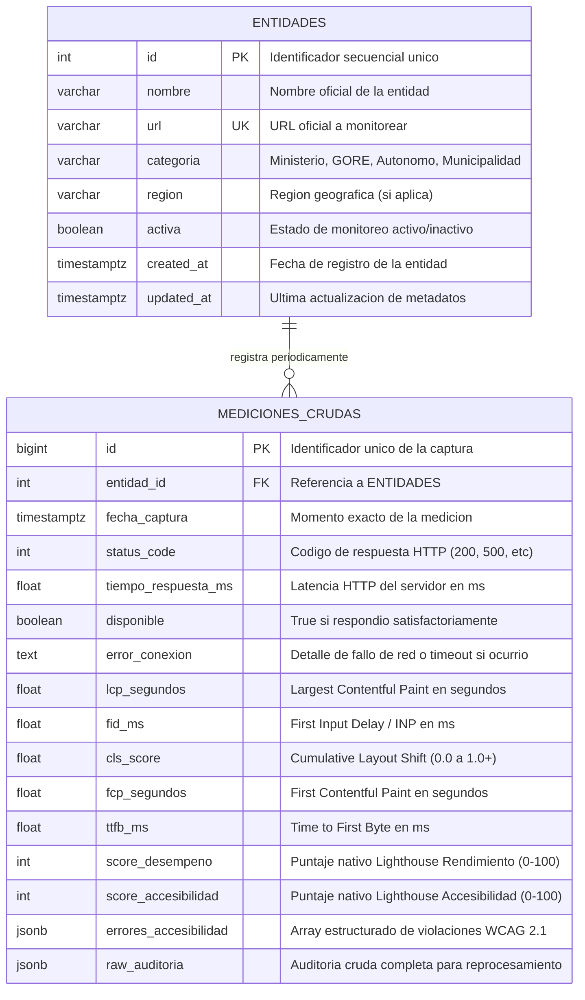

# Modelo Base de Datos - Fase 1 (Ingesta de Métricas Crudas)

* **Documento:** Diseño de Modelo Relacional (PostgreSQL)
* **Fecha:** 2026-09-27
* **Estado:** Aceptado para Fase 1
* **Enfoque:** Recolección Cruda Mínima Viable y Desacoplamiento de Lógica de Negocio

---

## 1. Estrategia en Dos Fases

Para cumplir con los objetivos del proyecto y permitir la recolección temprana de telemetría sin bloquear el desarrollo por decisiones metodológicas pendientes, la persistencia se divide en dos fases:

```
┌─────────────────────────────────────────────────────────┐
│               FASE 1: CAPTURA CRUDA (Actual)            │
│  - Catálogo Maestro de 90 Entidades                     │
│  - Telemetría Objetiva Observada (HTTP + PageSpeed)     │
│  - Cero juicios subjetivos o veredictos de negocio      │
└────────────────────────────┬────────────────────────────┘
                             │  Alimenta mediante análisis
                             ▼
┌─────────────────────────────────────────────────────────┐
│          FASE 2: PROCESAMIENTO Y SLAS (Posterior)       │
│  - Reglas de juicio y cálculo de SLAs (ITIL v4)         │
│  - Clasificación y ciclo de vida de Incidentes          │
│  - Normalización y Puntajes Globales Ponderados (0-100) │
│  - Vistas Materializadas para Rankings del Dashboard    │
└─────────────────────────────────────────────────────────┘
```

### ¿Por qué NO incluir SLAs, Incidentes ni Puntajes Ponderados en Fase 1?
1. **Los SLAs son juicios basados en el tiempo:** Un Acuerdo de Nivel de Servicio (ej. *Uptime mensual ≥ 99.5%*) no es una medición instantánea, sino un veredicto analítico calculado sobre la serie temporal de capturas.
2. **Los incidentes requieren correlación de estados:** Un incidente de caída según ITIL v4 inicia cuando un portal responde con error HTTP y finaliza cuando vuelve a estar en 200 OK. Registrar esto como un texto estático dentro de cada captura desnormaliza la base de datos.
3. **Calibración empírica de la fórmula:** La ponderación final (ej. 40% disponibilidad, 30% velocidad, 30% accesibilidad) debe validarse contra la dispersión real de los datos recogidos de las 90 entidades peruanas antes de fijarla en piedra.

---

## 2. Diagrama Entidad-Relación (Mermaid)

El modelo de Fase 1 está compuesto por **dos tablas normalizadas**: el catálogo maestro `entidades` y la serie temporal de telemetría `mediciones_crudas`.



---

## 3. Diccionario de Datos Detallado

### 3.1. Tabla: `entidades`
Almacena el catálogo de los 90 portales web estatales seleccionados.

| Campo | Tipo | Nulo | Descripción y Criterio |
| :--- | :--- | :---: | :--- |
| `id` | `SERIAL` | No | Clave primaria autoincremental. |
| `nombre` | `VARCHAR(255)` | No | Nombre oficial de la entidad (ej. *"Ministerio de Salud (MINSA)"*). |
| `url` | `VARCHAR(500)` | No | URL pública institucional (Única, ej. `https://www.gob.pe/minsa`). |
| `categoria` | `VARCHAR(50)` | No | Categoría administrativa: `'Ministerio'`, `'GORE'`, `'Organismo Autónomo'`, `'Municipalidad Provincial'`. |
| `region` | `VARCHAR(100)` | Sí | Región política (obligatorio para GOREs y Municipalidades; `NULL` para Ministerios y Organismos Autónomos de alcance nacional). |
| `activa` | `BOOLEAN` | No | Flag para pausar el monitoreo de un portal sin borrar su historial (`DEFAULT TRUE`). |
| `created_at` | `TIMESTAMPTZ` | No | Fecha/hora de alta de la entidad (`DEFAULT CURRENT_TIMESTAMP`). |
| `updated_at` | `TIMESTAMPTZ` | No | Fecha/hora de última modificación de datos de la entidad. |

---

### 3.2. Tabla: `mediciones_crudas`
Almacena cada evento de monitoreo y auditoría obtenido por el script de recolección (GitHub Actions / local).

#### A. Identificación y Disponibilidad (RF-001, RF-002, ITIL v4 Eventos)
| Campo | Tipo | Nulo | Descripción y Criterio |
| :--- | :--- | :---: | :--- |
| `id` | `BIGSERIAL` | No | Clave primaria para grandes volúmenes de telemetría. |
| `entidad_id` | `INTEGER` | No | Clave foránea referenciando a `entidades(id)` con `ON DELETE CASCADE`. |
| `fecha_captura` | `TIMESTAMPTZ` | No | Marca temporal exacta de inicio de la prueba (`DEFAULT CURRENT_TIMESTAMP`). |
| `status_code` | `INTEGER` | Sí | Código HTTP devuelto por el servidor (200, 301, 403, 404, 500, 502, 503). |
| `tiempo_respuesta_ms` | `FLOAT` | Sí | Tiempo de respuesta HTTP (latencia de conexión y primer byte) en milisegundos. |
| `disponible` | `BOOLEAN` | No | `TRUE` si `status_code = 200` (o redirección válida exitosa); `FALSE` ante errores de servidor o de red. |
| `error_conexion` | `TEXT` | Sí | Registro de excepciones en caso de fallo crítico (ej. `ConnectionTimeout`, `SSLError`, `NameResolutionError`). |

#### B. Desempeño y Core Web Vitals (RF-003, Google PageSpeed API)
| Campo | Tipo | Nulo | Descripción y Criterio |
| :--- | :--- | :---: | :--- |
| `lcp_segundos` | `FLOAT` | Sí | **Largest Contentful Paint** en segundos (Tiempo de despliegue del contenido principal). Ideal: ≤ 2.5s. |
| `fid_ms` | `FLOAT` | Sí | **First Input Delay / INP** en milisegundos (Tiempo de respuesta a la primera interacción). Ideal: ≤ 100ms. |
| `cls_score` | `FLOAT` | Sí | **Cumulative Layout Shift** (Estabilidad visual durante la carga). Ideal: ≤ 0.1. |
| `fcp_segundos` | `FLOAT` | Sí | **First Contentful Paint** en segundos (Primer renderizado con contenido visual). |
| `ttfb_ms` | `FLOAT` | Sí | **Time to First Byte** en milisegundos (Tiempo que tarda el navegador en recibir el primer byte de respuesta). |
| `score_desempeno` | `INTEGER` | Sí | Puntaje directo (0 - 100) emitido por la auditoría de rendimiento de Lighthouse/PageSpeed. |

#### C. Accesibilidad Web (RF-004, WCAG 2.1 nivel AA)
| Campo | Tipo | Nulo | Descripción y Criterio |
| :--- | :--- | :---: | :--- |
| `score_accesibilidad` | `INTEGER` | Sí | Puntaje directo (0 - 100) de accesibilidad devuelto por Lighthouse. |
| `errores_accesibilidad` | `JSONB` | Sí | Lista estructurada de violaciones a WCAG 2.1 (ID de auditoría fallada, descripción, selectores y elementos infractores). |

#### D. Auditoría Cruda Sin Pérdidas (Trazabilidad RNF-009)
| Campo | Tipo | Nulo | Descripción y Criterio |
| :--- | :--- | :---: | :--- |
| `raw_auditoria` | `JSONB` | Sí | Payload JSON original retornado por la API de Google PageSpeed Insights. Permite auditar detalles forenses o reprocesar métricas futuras sin perder datos históricos. |

---

## 4. Script DDL para PostgreSQL (`schema_fase1.sql`)

A continuación se presenta el script listo para ser ejecutado en PostgreSQL (Supabase, Neon o Docker local):

```sql
-- =============================================================================
-- OBSERVATORIO DE CALIDAD DIGITAL PÚBLICA
-- Esquema de Base de Datos - Fase 1: Ingesta de Datos Crudos
-- =============================================================================

-- 1. Tabla de Catálogo Maestro de Entidades
CREATE TABLE IF NOT EXISTS entidades (
    id SERIAL PRIMARY KEY,
    nombre VARCHAR(255) NOT NULL,
    url VARCHAR(500) NOT NULL UNIQUE,
    categoria VARCHAR(50) NOT NULL CHECK (
        categoria IN ('Ministerio', 'GORE', 'Organismo Autónomo', 'Municipalidad Provincial')
    ),
    region VARCHAR(100),
    activa BOOLEAN NOT NULL DEFAULT TRUE,
    created_at TIMESTAMPTZ NOT NULL DEFAULT CURRENT_TIMESTAMP,
    updated_at TIMESTAMPTZ NOT NULL DEFAULT CURRENT_TIMESTAMP
);

-- 2. Tabla de Mediciones Crudas de Telemetría
CREATE TABLE IF NOT EXISTS mediciones_crudas (
    id BIGSERIAL PRIMARY KEY,
    entidad_id INTEGER NOT NULL REFERENCES entidades(id) ON DELETE CASCADE,
    fecha_captura TIMESTAMPTZ NOT NULL DEFAULT CURRENT_TIMESTAMP,
    
    -- Telemetría de Disponibilidad HTTP
    status_code INTEGER,
    tiempo_respuesta_ms FLOAT,
    disponible BOOLEAN NOT NULL,
    error_conexion TEXT,
    
    -- Métricas de Desempeño (Core Web Vitals crudos de Google)
    lcp_segundos FLOAT,
    fid_ms FLOAT,
    cls_score FLOAT,
    fcp_segundos FLOAT,
    ttfb_ms FLOAT,
    score_desempeno INTEGER CHECK (score_desempeno BETWEEN 0 AND 100),
    
    -- Métricas de Accesibilidad (Lighthouse / WCAG 2.1)
    score_accesibilidad INTEGER CHECK (score_accesibilidad BETWEEN 0 AND 100),
    errores_accesibilidad JSONB,
    
    -- Respaldo crudo completo de la API
    raw_auditoria JSONB
);

-- 3. Índices de Rendimiento para Consultas Temporales
CREATE INDEX IF NOT EXISTS idx_mediciones_entidad_fecha 
    ON mediciones_crudas (entidad_id, fecha_captura DESC);

CREATE INDEX IF NOT EXISTS idx_mediciones_fecha_captura 
    ON mediciones_crudas (fecha_captura DESC);

CREATE INDEX IF NOT EXISTS idx_entidades_categoria_region 
    ON entidades (categoria, region);
```

---

## 5. Proyección hacia la Fase 2 (Construcción del Backend)

Cuando se hayan acumulado suficientes datos empíricos de las 90 entidades, la Fase 2 incorporará:

1. **Tabla/Vista de Incidentes de Servicio (`incidentes` - ITIL v4):**
   - Agrupación algorítmica de fallos consecutivos donde `disponible = false` para calcular la duración exacta del incidente, fecha de detección y fecha de resolución.
2. **Evaluación de SLAs (`cumplimiento_slas`):**
   - Agregaciones mensuales comparando el uptime real acumulado frente al umbral acordado (ej. 99.5%).
3. **Puntajes Globales Normalizados (`scores_entidades`):**
   - Cálculo del score compuesto de 0 a 100 aplicando la fórmula que se defina objetivamente sobre los datos reales.
